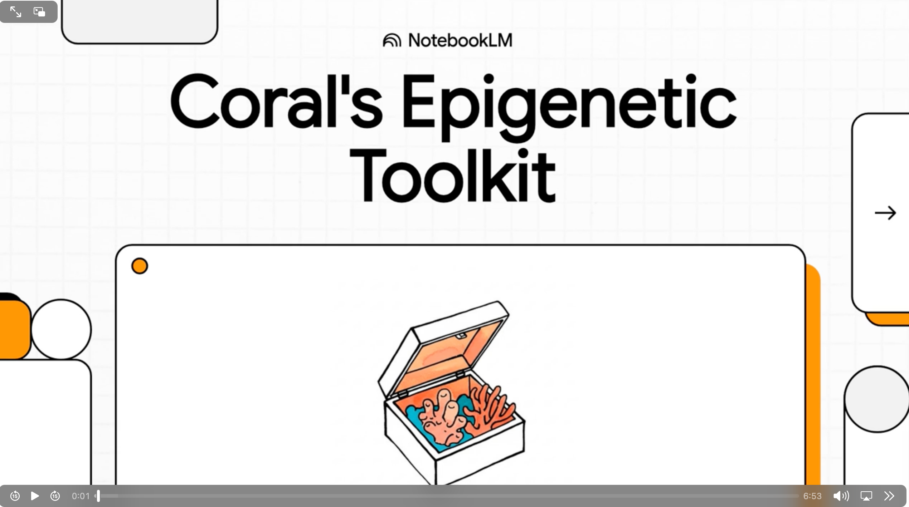

# Week 2: Environmental Stressors and Gene Expression

## Learning Objectives

By the end of this week, students will be able to: - Identify major environmental stressors affecting marine organisms - Understand how environmental factors influence gene expression patterns - Analyze experimental approaches for studying stress responses - Evaluate the role of epigenetics in stress adaptation

## Key Topics

1.  **Major Environmental Stressors**
    -   Temperature fluctuations
    -   Salinity changes
    -   Ocean acidification (pH changes)
    -   Hypoxia/anoxia
    -   Pollution and contaminants
2.  **Stress Response Mechanisms**
    -   Heat shock proteins
    -   Oxidative stress responses
    -   Cellular stress pathways
    -   Epigenetic regulation of stress genes
3.  **Experimental Approaches**
    -   Laboratory stress experiments
    -   Field studies and natural populations
    -   Multi-generational exposure studies
    -   Molecular techniques for measuring responses

## Required Readings

-   [Hofmann, G.E. (2017). Ecological epigenetics in marine metazoans. *Frontiers in Marine Science*, 4, 4.](fmars-04-00004.pdf)
-   [Kenkel, C.D. & Matz, M.V. (2016). Gene expression plasticity as a mechanism of coral adaptation to a variable environment. *Nature Ecology & Evolution*, 1, 0014.](s41559-016-0014.pdf)

## Supplementary Readings

-   [Putnam, H. M., Davidson, J. M., & Gates, R. D. (2016). Ocean acidification influences host DNA methylation and phenotypic plasticity in environmentally susceptible corals. Evolutionary Applications, 9(9), 1165–1178. https://doi.org/10.1111/eva.12408](EVA-9-1165.pdf)

## Discussion Questions

1.  Which environmental stressors pose the greatest challenges for marine organisms, and why?
2.  How do acute versus chronic stress exposures differ in their epigenetic effects?
3.  What are the trade-offs between plastic responses and evolutionary adaptation to environmental stress?

## Activities

-   White Boarding big concepts / Lab/Field Methods
-   Presentation assignments
-   Logistics

### Video Summary

## Lab/Field Methods Focus

-   Experimental design for stress exposure studies
-   Gene expression analysis techniques
-   Environmental monitoring and data collection

## Assessment

-   Participation in discussion (formative)
-   Participation in White Boarding (formative)

------------------------------------------------------------------------

*Next week: DNA Methylation in Marine Species*
